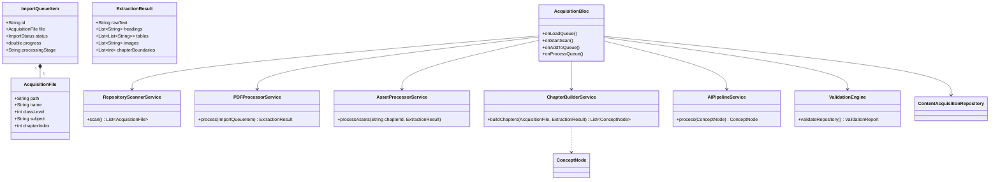

# Content Acquisition Manager Class Diagram

```mermaid
classDiagram
    class AcquisitionFile {
        +String path
        +String name
        +int classLevel
        +String subject
        +int chapterIndex
    }

    class ImportQueueItem {
        +String id
        +AcquisitionFile file
        +ImportStatus status
        +double progress
        +String processingStage
    }

    class ExtractionResult {
        +String rawText
        +List~String~ headings
        +List~List~String~~ tables
        +List~String~ images
        +List~int~ chapterBoundaries
    }

    class AcquisitionBloc {
        +onLoadQueue()
        +onStartScan()
        +onAddToQueue()
        +onProcessQueue()
    }

    class RepositoryScannerService {
        +scan() List~AcquisitionFile~
    }

    class PDFProcessorService {
        +process(ImportQueueItem) ExtractionResult
    }

    class AssetProcessorService {
        +processAssets(String chapterId, ExtractionResult)
    }

    class ChapterBuilderService {
        +buildChapters(AcquisitionFile, ExtractionResult) List~ConceptNode~
    }

    class AIPipelineService {
        +process(ConceptNode) ConceptNode
    }

    class ValidationEngine {
        +validateRepository() ValidationReport
    }

    AcquisitionBloc --> ContentAcquisitionRepository
    AcquisitionBloc --> RepositoryScannerService
    AcquisitionBloc --> PDFProcessorService
    AcquisitionBloc --> ChapterBuilderService
    AcquisitionBloc --> AssetProcessorService
    AcquisitionBloc --> AIPipelineService
    AcquisitionBloc --> ValidationEngine

    ImportQueueItem "1" *-- "1" AcquisitionFile
    ChapterBuilderService ..> ConceptNode
```
